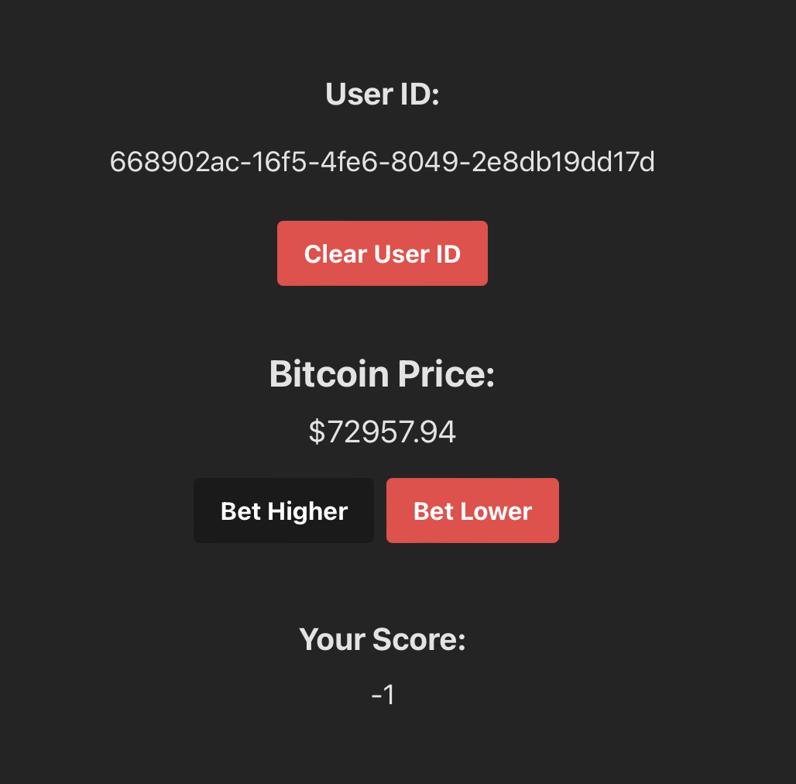

# BTC Price Prediction Project - Frontend

This README contains instructions on how to use the frontend part of the BTC price prediction project.

[Project URL](https://d386ooxqoh3yz8.cloudfront.net).

## Tech stack

The project was created using **Vite, React, Typescript, Tailwind, and Axios**.

## Project overview

If this is your first time using the project on your browser, you will need to generate a user ID. Press the "Set User ID" button to be assigned a unique one, which will be stored in local storage. You can delete it from local storage and generate a new random one by pressing the button again.

Below you will see the real-time BTC price and can make a prediction. Once you make a prediction, the buttons will disable, and you will not be able to place a new one until your pending prediction is resolved.

At the bottom of the page, you will see your current score, updated whenever your prediction is resolved. You gain one point for a correct prediction and lose a point for an incorrect one.

### Usage testing

There are two ways to run this system:

1. Access the already deployed and ready-to-go app at [this URL](https://d386ooxqoh3yz8.cloudfront.net).
2. Run the project locally in development mode and connect it to your own deployed backend, or use the already deployed backend endpoints (see the **Setup** section for more details).

### Architecture

The app follows the atomic architecture principles, being split into several types of building blocks (**templates, organisms, molecules, atoms**). This ensures readability and scalability of our functional components.

## Local Development

### Prerequisites

- Node.js and npm installed

### Setup

1. Run `npm i` at the root level to install all the required node modules.
2. **(Optional)** Switch AWS backend URL: If you redeployed the backend on a different AWS account and want to switch to that, you can modify the root URL of the API in the `src/constants/appConstants.ts` file.
3. Run `npm run dev` to start the development.

## Future Plans

The biggest constraint in developing this app was time. Therefore, there are many improvements that could be added gradually. Here are a couple of ways this project could be improved:

1. **Testing**: Use Jest to create unit tests for the utils functions and the functional components to improve project robustness.
2. **Better State Management**: Implement a state management library (such as Redux) to ensure seamless state passing between components and avoid prop drilling.
3. **Improved Design**: Enhance the design using Tailwind or other tools to boost usability.
4. **Automated Build and Deployment**: Utilize git actions to build and redeploy the project programmatically.

## Backend

The backend repository can be accessed at [this URL](https://github.com/DavidCandreanu00/BTC-Price-predictor-BE).

